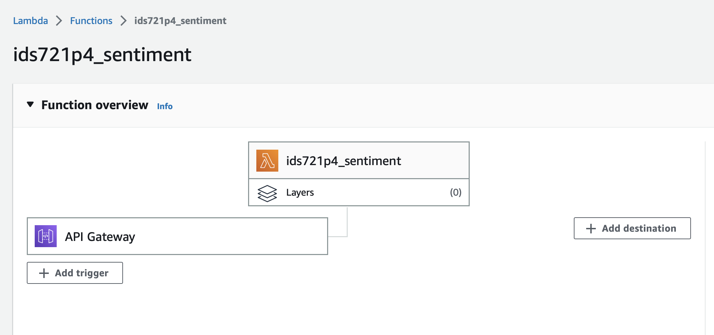
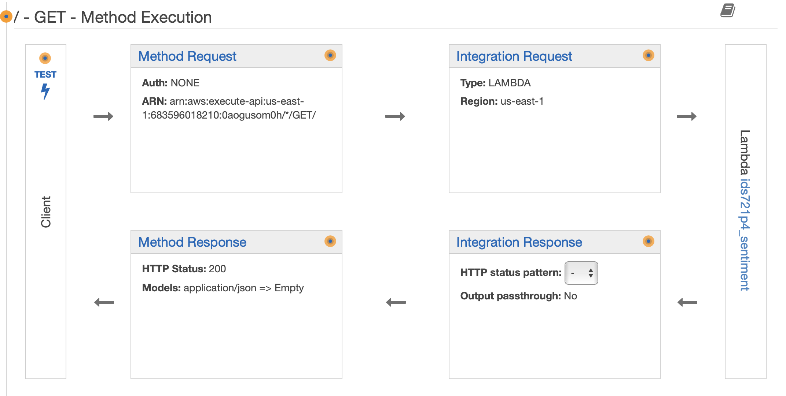

# IDS721 Project 4 

## Serverless Data Engineering Pipeline for Sentiment Analysis 

In this project, language sentiment analysis is deployed using AWS Lambda serverless technologies. 

The basic architecture is showed in following image:

1. lambda_handler function is implemented for getting sentiment analysis result from AWS Comprehend and returning the response. 
2. AWS API Gateway is implemented for deploying this AWS Lambda function. 

