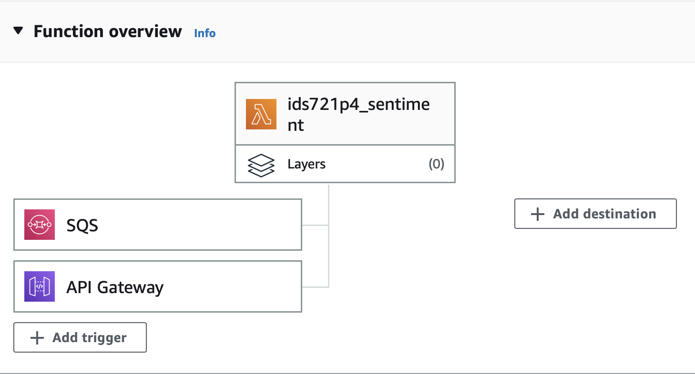
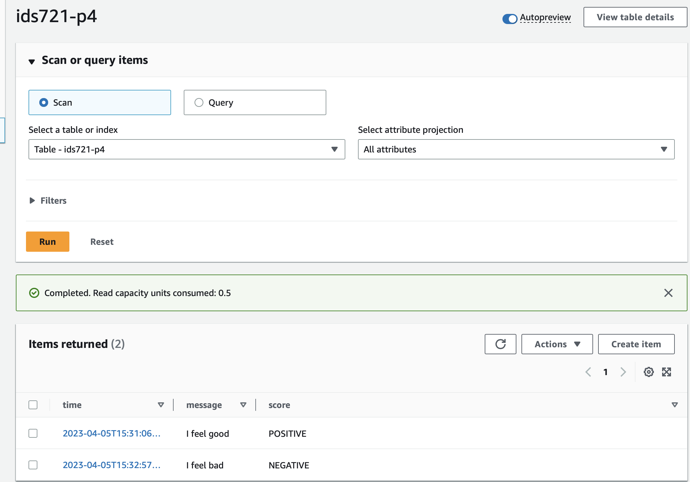

# IDS721 Project 4 

## Serverless Data Engineering Pipeline for Sentiment Analysis 

#### About

In this project, language sentiment analysis is deployed using AWS Lambda serverless technologies. 

The basic architecture is showed in following image:

1. lambda_handler function is implemented for getting sentiment analysis result from AWS Comprehend and returning the response. 
2. AWS API Gateway is implemented for deploying this AWS Lambda function. 
3. AWS SQS: SQS enables you to send, store, and receive messages between different components of your application or different applications in a loosely coupled way. It provides a reliable, scalable, and highly available way to decouple application components and enable asynchronous processing.
4. DynamoDB: DynamoDB is implemented for store all queries. 

#### Usage

Send RUST GET to https://0aogusom0h.execute-api.us-east-1.amazonaws.com/init with your sentence in "Text" field. The result will be showed in "Response" field in RUST response. One example is following:

